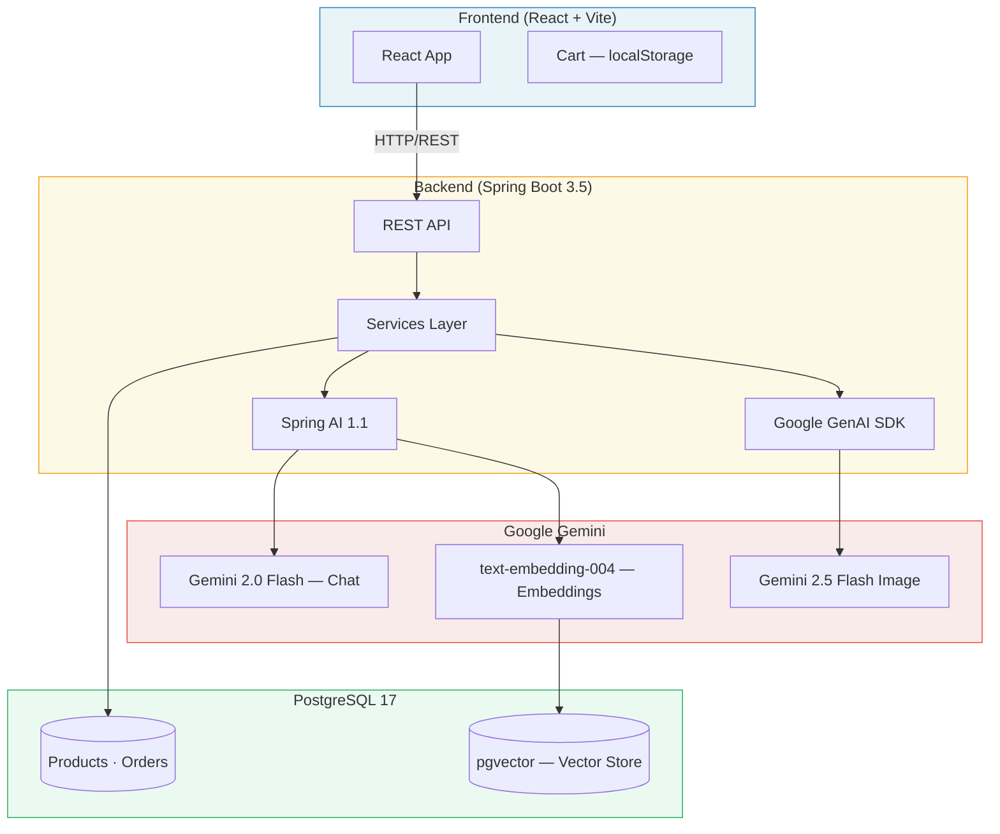
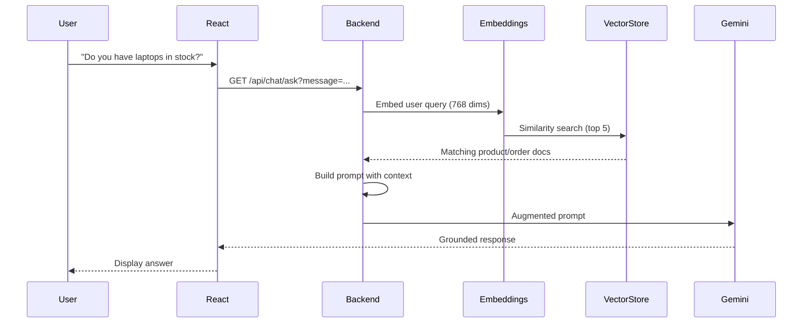
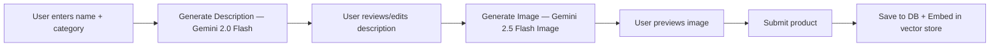

# SpringEcomAI

Full-stack e-commerce platform with AI-powered features. Built with Spring Boot and React, using Google Gemini for product description generation, image generation, and a RAG-based chatbot.

[](https://ecom.ignalarcon.dev)

## Features

- **Product Management** — CRUD operations with image upload
- **AI Description Generator** — generates product descriptions from name and category using Gemini 2.0 Flash
- **AI Image Generator** — creates product images using Gemini 2.5 Flash Image
- **RAG Chatbot** — answers questions about products and orders using semantic search over a vector store
- **Order System** — place orders with automatic stock management
- **Search** — keyword-based product search

## Architecture



## How the AI Features Work

### RAG Chatbot



### AI Product Creation



## Project Structure

```
.
├── README.md                ← You are here
├── docker-compose.yml       ← Run everything locally
├── SpringEcomAI/            ← Backend (Spring Boot)
│   ├── Dockerfile
│   ├── README.md
│   └── src/
└── t-ecom/                  ← Frontend (React)
    ├── Dockerfile
    ├── nginx.conf
    ├── README.md
    └── src/
```

See [Backend README](./SpringEcomAI/README.md) and [Frontend README](./t-ecom/README.md) for details on each.

## Tech Stack

| Component | Technology |
|-----------|-----------|
| Frontend | React 18, Vite 7, Bootstrap 5 |
| Backend | Spring Boot 3.5, Java 21, Spring AI 1.1 |
| AI Chat & Descriptions | Google Gemini 2.0 Flash |
| AI Image Generation | Google GenAI SDK → Gemini 2.5 Flash Image |
| Embeddings | Google text-embedding-004 (768 dims) |
| Database | PostgreSQL 17 + pgvector |
| Containerization | Docker + Nginx |

## Quick Start

### Prerequisites

- Java 21+
- Node.js 18+
- PostgreSQL 17 with pgvector extension
- Google Cloud project with Gemini API key and Vertex AI enabled

### Run with Docker Compose

```bash
# Set your API key
export GEMINI_API_KEY=your_api_key_here

# Start all services
docker compose up --build
```

| Service | URL |
|---------|-----|
| Frontend | http://localhost:3000 |
| Backend | http://localhost:8080 |
| PostgreSQL | localhost:5432 |

### Run Manually

**Backend:**
```bash
cd SpringEcomAI
mvn spring-boot:run
```

**Frontend:**
```bash
cd t-ecom
npm install
npm run dev
```

## Environment Variables

| Variable | Description | Required |
|----------|-------------|----------|
| `GEMINI_API_KEY` | Google Gemini API key | Yes |
| `DB_PASSWORD` | PostgreSQL password | Yes (Docker) |
| `VITE_BASE_URL` | Backend URL for frontend | Yes |

## API Endpoints

### Products

| Method | Endpoint | Description |
|--------|----------|-------------|
| `GET` | `/api/products` | List all products |
| `GET` | `/api/product/{id}` | Get product by ID |
| `POST` | `/api/product` | Add product (multipart) |
| `PUT` | `/api/product/{id}` | Update product |
| `DELETE` | `/api/product/{id}` | Delete product |
| `GET` | `/api/products/search?keyword=` | Search products |

### AI Features

| Method | Endpoint | Description |
|--------|----------|-------------|
| `POST` | `/api/product/generate-description` | AI product description |
| `POST` | `/api/product/generate-image` | AI product image |
| `GET` | `/api/chat/ask?message=` | RAG chatbot |

### Orders

| Method | Endpoint | Description |
|--------|----------|-------------|
| `POST` | `/api/orders/place` | Place an order |
| `GET` | `/api/orders` | List all orders |

## Author

[Ignacio Alarcón Varela](https://ignalarcon.dev/)
