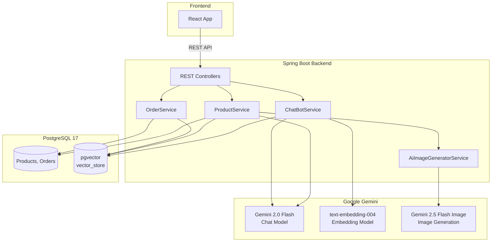
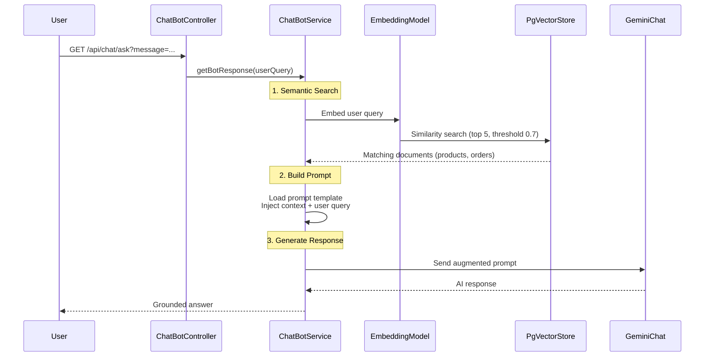
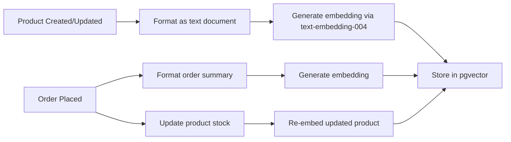
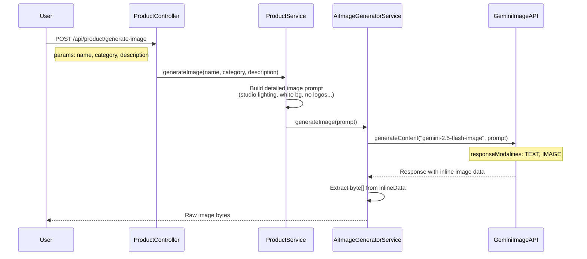

# SpringEcomAI

E-commerce platform with AI-powered features built with Spring Boot and Google Gemini.

## Tech Stack

| Layer | Technology |
|-------|-----------|
| Backend | Spring Boot 3.5.10, Java 21 |
| AI (Chat & Descriptions) | Spring AI 1.1.1 → Google Gemini 2.0 Flash |
| AI (Image Generation) | Google GenAI SDK → Gemini 2.5 Flash Image |
| AI (Embeddings) | Google text-embedding-004 via Vertex AI |
| Vector Store | PostgreSQL 17 + pgvector |
| ORM | Spring Data JPA / Hibernate |
| Frontend | React (separate project) |

## Architecture Overview



## RAG Chatbot Flow

The chatbot uses Retrieval-Augmented Generation (RAG) to answer questions about products and orders using real data from the database.



### How Data Gets Into the Vector Store

Products and orders are automatically embedded and stored when created or updated:



## AI Image Generation Flow

Image generation uses the Google GenAI SDK directly (not Spring AI) to call the Gemini 2.5 Flash Image model.



## API Endpoints

### Products

| Method | Endpoint | Description |
|--------|----------|-------------|
| `GET` | `/api/products` | List all products |
| `GET` | `/api/product/{id}` | Get product by ID |
| `GET` | `/api/product/{id}/image` | Get product image |
| `POST` | `/api/product` | Add product (multipart: product + image) |
| `PUT` | `/api/product/{id}` | Update product |
| `DELETE` | `/api/product/{id}` | Delete product |
| `GET` | `/api/products/search?keyword=` | Search products |

### AI Features

| Method | Endpoint | Description |
|--------|----------|-------------|
| `POST` | `/api/product/generate-description?name=&category=` | Generate AI product description |
| `POST` | `/api/product/generate-image?name=&category=&description=` | Generate AI product image |
| `GET` | `/api/chat/ask?message=` | RAG chatbot |

### Orders

| Method | Endpoint | Description |
|--------|----------|-------------|
| `POST` | `/api/orders/place` | Place an order |
| `GET` | `/api/orders` | List all orders |

## Setup

### Prerequisites

- Java 21+
- PostgreSQL 17 with pgvector extension
- Google Cloud project with:
    - Gemini API key ([AI Studio](https://aistudio.google.com/apikey))
    - Vertex AI API enabled
    - Billing account linked

### Configuration

```properties
# Database
spring.datasource.url=jdbc:postgresql://localhost:5432/local
spring.datasource.username=your_username
spring.datasource.password=your_password

# Google Gemini AI
spring.ai.google.genai.api-key=YOUR_API_KEY
spring.ai.google.genai.project-id=YOUR_GCP_PROJECT_ID
spring.ai.google.genai.embedding.project-id=YOUR_GCP_PROJECT_ID
spring.ai.google.genai.embedding.location=us-central1
spring.ai.google.genai.chat.options.model=gemini-2.0-flash
spring.ai.google.genai.embedding.options.model=text-embedding-004
```

### Run

```bash
chmod +x mvnw
./mvnw spring-boot:run
```

The backend starts on `http://localhost:8080`.