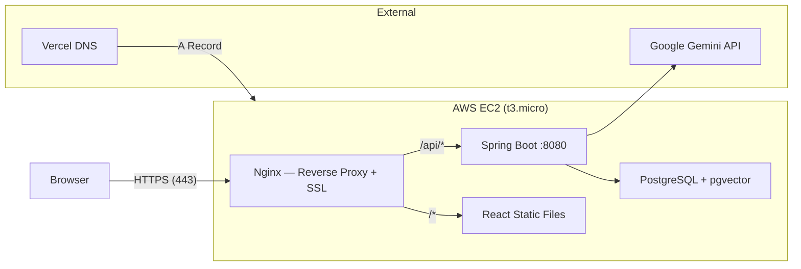

# Deployment Guide — AWS EC2

Step-by-step guide to deploy SpringEcomAI on AWS using Docker Compose, with HTTPS and a custom domain.

## Architecture



## Prerequisites

- AWS account (free tier eligible)
- Google Cloud project with:
  - Gemini API key ([aistudio.google.com/apikey](https://aistudio.google.com/apikey))
  - Vertex AI API enabled
  - Service account with Vertex AI User role + JSON key
- Domain with DNS access (this guide uses Vercel DNS)

## 1. Launch EC2 Instance

1. Go to **EC2** → **Launch Instance**
2. Configure:
   - **Name:** `springecomai`
   - **AMI:** Ubuntu Server 24.04 LTS (x86)
   - **Instance type:** `t3.micro` (free tier)
   - **Key pair:** Create new → RSA → `.pem` format → download and keep safe
   - **Storage:** 20 GB gp3
3. **Security Group** inbound rules:

   | Type | Port | Source |
   |------|------|--------|
   | SSH | 22 | Your IP (or 0.0.0.0/0) |
   | HTTP | 80 | 0.0.0.0/0 |
   | HTTPS | 443 | 0.0.0.0/0 |

4. Launch and allocate an **Elastic IP** (EC2 → Elastic IPs → Allocate → Associate to instance)

## 2. Connect via SSH

```bash
chmod 400 ~/Downloads/springecomai-key.pem
ssh -i ~/Downloads/springecomai-key.pem ubuntu@<YOUR_ELASTIC_IP>
```

## 3. Install Docker

```bash
sudo apt update && sudo apt upgrade -y
sudo apt install -y docker.io docker-compose-v2
sudo usermod -aG docker ubuntu
```

Log out and back in:

```bash
exit
ssh -i ~/Downloads/springecomai-key.pem ubuntu@<YOUR_ELASTIC_IP>
```

Verify:

```bash
docker --version
```

## 4. Add Swap Memory

The t3.micro has 1GB RAM which is not enough for building Docker images. Add 2GB swap:

```bash
sudo fallocate -l 2G /swapfile
sudo chmod 600 /swapfile
sudo mkswap /swapfile
sudo swapon /swapfile
echo '/swapfile none swap sw 0 0' | sudo tee -a /etc/fstab
```

## 5. Clone the Repository

```bash
git clone https://github.com/iav2002/E-Commerce_Gemini.git
cd E-Commerce_Gemini
```

## 6. Upload GCP Service Account Key

From your **local machine** (not EC2):

```bash
scp -i ~/Downloads/springecomai-key.pem /path/to/your-gcp-key.json ubuntu@<YOUR_ELASTIC_IP>:~/E-Commerce_Gemini/gcp-key.json
```

## 7. Configure Environment Variables

On EC2:

```bash
echo 'export GEMINI_API_KEY=your_api_key_here' >> ~/.bashrc
source ~/.bashrc
```

## 8. Modify docker-compose.yml for Production

The repo's `docker-compose.yml` is configured for local development. For production, make these changes:

```bash
nano docker-compose.yml
```

**Backend service** — add GCP credentials:

```yaml
  backend:
    restart: unless-stopped
    # ... existing config ...
    environment:
      # ... existing env vars ...
      GOOGLE_APPLICATION_CREDENTIALS: /app/gcp-key.json
    volumes:
      - ./gcp-key.json:/app/gcp-key.json:ro
```

**Frontend service** — update for production:

```yaml
  frontend:
    restart: unless-stopped
    build:
      context: ./t-ecom
      dockerfile: Dockerfile
      args:
        VITE_BASE_URL: ""
    ports:
      - "80:80"
      - "443:443"
    volumes:
      - /etc/letsencrypt:/etc/letsencrypt:ro
    depends_on:
      - backend
```

`VITE_BASE_URL` is empty because Nginx proxies API calls internally — the browser never needs to know the backend's address.

**All services** — add `restart: unless-stopped` so containers auto-restart on reboot.

## 9. Configure Nginx as Reverse Proxy

Edit the frontend's Nginx config:

```bash
nano t-ecom/nginx.conf
```

Replace with:

```nginx
server {
    listen 80;
    server_name your-domain.dev;
    return 301 https://$host$request_uri;
}

server {
    listen 443 ssl;
    server_name your-domain.dev;

    ssl_certificate /etc/letsencrypt/live/your-domain.dev/fullchain.pem;
    ssl_certificate_key /etc/letsencrypt/live/your-domain.dev/privkey.pem;

    root /usr/share/nginx/html;
    index index.html;

    # Proxy API requests to the Spring Boot backend
    location /api/ {
        proxy_pass http://backend:8080;
        proxy_set_header Host $host;
        proxy_set_header X-Real-IP $remote_addr;
    }

    # SPA routing — all non-file requests go to index.html
    location / {
        try_files $uri $uri/ /index.html;
    }

    # Cache static assets
    location ~* \.(js|css|png|jpg|jpeg|gif|ico|svg|woff2?)$ {
        expires 1y;
        add_header Cache-Control "public, immutable";
    }
}
```

### Why Nginx?

In development, Vite serves the React app and you call the backend directly at `localhost:8080`. In production:

- Vite is not needed — `npm run build` compiles everything into static HTML/JS/CSS files
- Nginx serves those static files efficiently
- Nginx also acts as a **reverse proxy**: when the browser requests `/api/*`, Nginx forwards it to the Spring Boot backend internally
- This means everything goes through **one domain on port 443** — no exposed backend ports

```
Browser → https://ecom.ignalarcon.dev/api/products
         → Nginx receives on :443
         → Forwards to backend:8080/api/products
         → Returns response to browser
```

## 10. Set Up DNS

Add an **A record** pointing your subdomain to the EC2 Elastic IP.

**For Vercel DNS:**

1. Go to Vercel Dashboard → Settings → Domains
2. Select your domain → DNS Records
3. Add record:
   - **Type:** A
   - **Name:** `ecom` (or your preferred subdomain)
   - **Value:** `<YOUR_ELASTIC_IP>`

DNS propagation usually takes a few minutes.

## 11. Set Up HTTPS with Let's Encrypt

Get a free SSL certificate:

```bash
# Stop frontend temporarily (certbot needs port 80)
docker compose stop frontend

# Get certificate
sudo certbot certonly --standalone -d your-domain.dev --email your@email.com --agree-tos

# Start everything
docker compose up --build -d
```

The certificate auto-renews via a systemd timer installed by certbot.

## 12. Enable Docker Auto-Start

Ensure Docker starts on reboot:

```bash
sudo systemctl enable docker
```

Combined with `restart: unless-stopped` in docker-compose, all containers will come back up automatically if the EC2 instance reboots.

## 13. Build and Run

```bash
cd ~/E-Commerce_Gemini
docker compose up --build -d
```

Verify all services are running:

```bash
docker compose logs backend --tail 20
```

Look for `Started SpringEcomApplication` in the logs.

## Verify Deployment

| Check | URL |
|-------|-----|
| Frontend | https://your-domain.dev |
| Backend API | https://your-domain.dev/api/products |
| Chatbot | https://your-domain.dev/askai |

## Key Differences: Local vs Production

| Aspect | Local Development | Production (EC2) |
|--------|-------------------|-------------------|
| Frontend server | Vite (`npm run dev`) | Nginx (Docker) |
| Backend URL | `http://localhost:8080` | Proxied via Nginx |
| VITE_BASE_URL | `http://localhost:8080` | Empty (same origin) |
| Database | Local PostgreSQL | PostgreSQL in Docker |
| HTTPS | Not needed | Let's Encrypt SSL |
| GCP credentials | `gcloud` CLI (auto) | Service account JSON key |

## Troubleshooting

**Instance won't respond via SSH:**
- Check security group allows SSH from your current IP
- If instance is frozen (out of memory), do a full Stop → Start from AWS Console (not just reboot)

**Backend fails with "Failed to get application default credentials":**
- Ensure `gcp-key.json` exists in the project root on EC2
- Verify the docker-compose mounts it and sets `GOOGLE_APPLICATION_CREDENTIALS`

**Chatbot returns "Bot Failed" with file path error:**
- The prompt template must be loaded with `getInputStream()` not `getFile()` — see `ChatBotService.java`
- `getFile()` works in development but fails inside a JAR

**Frontend shows "Something went wrong" / unplugged image:**
- Check `VITE_BASE_URL` — in production it should be empty
- Verify the custom axios instance (`src/axios.jsx`) has an empty `baseURL`
- Check browser console for `localhost` references — these indicate the frontend is still trying to call the local backend

**Docker build freezes:**
- The t3.micro only has 1GB RAM — ensure swap is enabled before building
- Run `free -h` to verify swap is active

**`.dev` domain not loading in browser:**
- All `.dev` domains require HTTPS — browsers refuse HTTP connections
- Set up SSL certificates before testing in a browser (curl will work with HTTP)
