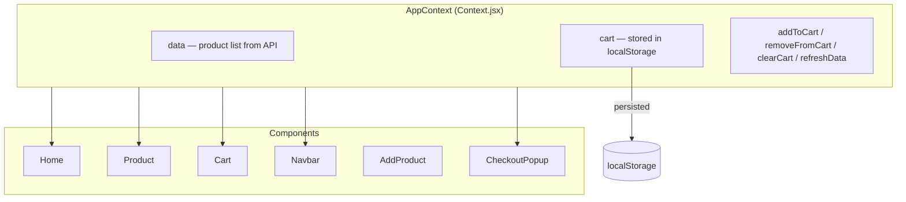
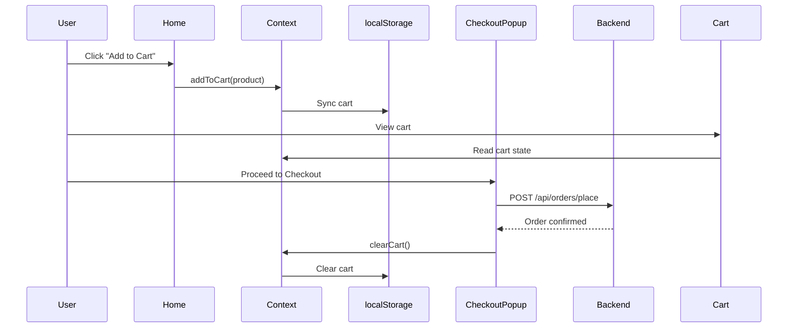

# SpringEcomAI — Frontend

React frontend for the SpringEcomAI e-commerce platform. Provides product browsing, cart management, order placement, and AI-powered features including chatbot, description generation, and image generation.

## Tech Stack

| Layer | Technology |
|-------|-----------|
| Framework | React 18 |
| Build Tool | Vite 7 |
| Styling | Bootstrap 5.3 + Bootstrap Icons |
| HTTP Client | Axios |
| Routing | React Router DOM 6 |
| Chat UI | @chatscope/chat-ui-kit-react |
| Notifications | React Toastify |

## Project Structure

```
t-ecom/
├── public/
├── src/
│   ├── assets/              # Static images (fallback img, etc.)
│   ├── components/
│   │   ├── AddProduct.jsx   # Product form + AI description/image generation
│   │   ├── AskAI.jsx        # RAG chatbot interface
│   │   ├── Cart.jsx         # Shopping cart with quantity controls
│   │   ├── CheckoutPopup.jsx # Order confirmation modal
│   │   ├── Home.jsx         # Product grid (main page)
│   │   ├── Navbar.jsx       # Navigation + search
│   │   ├── Order.jsx        # Order history table
│   │   ├── Product.jsx      # Single product detail view
│   │   ├── SearchResults.jsx # Search results grid
│   │   └── UpdateProduct.jsx # Edit existing product
│   ├── Context/
│   │   └── Context.jsx      # Global state (products, cart)
│   ├── axios.jsx            # Axios instance with base URL
│   ├── App.jsx              # Routes + layout
│   └── main.jsx             # Entry point
├── .env                     # Environment variables
├── index.html
├── package.json
└── vite.config.js
```

## State Management

The app uses React Context API for global state. No external state library needed.



### Cart Flow

Cart state lives in React Context and syncs to `localStorage` so it survives page refreshes. There is no backend cart endpoint — it's entirely frontend-managed.



## AI Features (Frontend Side)

### Description Generation
On the Add Product page, once name and category are filled, the user can click "Generate with AI". This calls `POST /api/product/generate-description` and populates the description field.

### Image Generation
Once name, category, and description are filled, the user can generate a product image via `POST /api/product/generate-image`. The response is a raw byte array converted to a blob for preview. On submit, the blob is sent as a `File` in the multipart form.

### RAG Chatbot
The Ask AI page uses `@chatscope/chat-ui-kit-react` for the chat interface. Messages are sent as `GET /api/chat/ask?message=...` and responses are rendered as incoming messages.

## Pages & Routes

| Route | Component | Description |
|-------|-----------|-------------|
| `/` | Home | Product grid with "Add to Cart" |
| `/add_product` | AddProduct | New product form + AI generation |
| `/product/:id` | Product | Product detail + edit/delete |
| `/product/update/:id` | UpdateProduct | Edit product form |
| `/cart` | Cart | Cart with quantity controls + checkout |
| `/askai` | AskAI | RAG chatbot |
| `/orders` | Order | Order history table |
| `/search-results` | SearchResults | Search results grid |

## Setup

### Prerequisites

- Node.js 18+
- npm or yarn

### Environment Variables

Create a `.env` file in the project root:

```env
VITE_BASE_URL="http://localhost:8080"
```

For production, point this to your deployed backend URL.

### Install & Run

```bash
npm install
npm run dev
```

The app starts on `http://localhost:5173` by default.

### Build for Production

```bash
npm run build
```

Output goes to `dist/` — serve with any static file server or Nginx.
